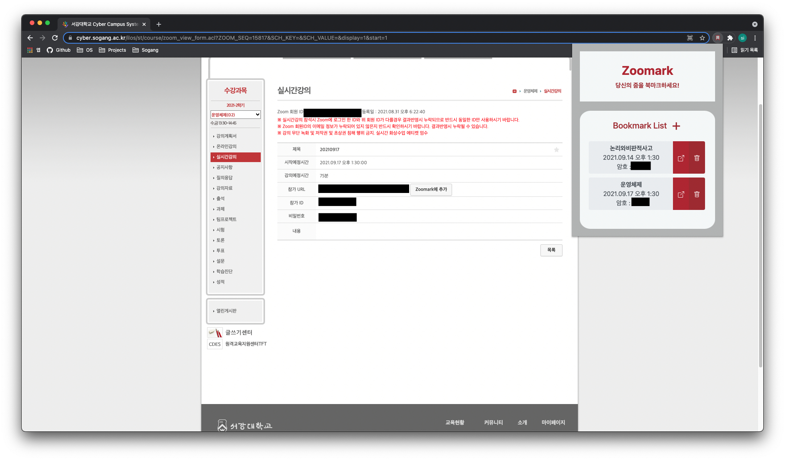

# Zoomark

줌 링크와 비밀번호를 북마크하기위한 크롬 확장프로그램입니다.

코로나시국 때문에 계속되는 Zoom meeting과 사이버강의를위해 편의성의 목적으로 만들어졌습니다.

서강대학교 Cyber 캠퍼스의 줌 강의 목록에 들어가면, button을 생성하여 편리하게 줌 링크와 비밀번호를 북마크해놓을 수 있습니다.

아마, HelloLMS에서 만든 사이버 캠퍼스를 사용하는 학교라면 permission 주소만 변경해준다면 사용가능할 것입니다.
